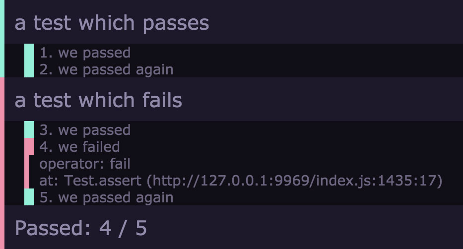

# tap-browser-el

[](http://github.com/badges/stability-badges)



A tap/tape reporter which adds a dom element to the dom

## Usage

[](https://www.npmjs.com/package/tap-browser-el)

`tap-browser-el` will override `console.log` and watch what's being pushed to it and parse any tap/tape content.

Example:
```javascript
require('tap-browser-el')( {
    // you can optionally pass in el
    // by default a <div> will be created on body
    el: someDomElementWhichTapContentWillBeWrittenTo,

    // you can pass in styles to override default styles
    // if css is not passed default styles will be applied
    // 
    // to apply no inline styles pass `false`
    css: {

        // pass in selector to apply css to parts
        // may seem redundant but it makes this module
        // more 
        '.tap-test.pass': {
            background: '#0F0'
        },

        '.tap-test.fail': {
            background: '#F00'
        }
    },

    // this is a callback you can pass for when one test is finished one part
    // of the test
    onFinishedTestPart: function() {}.

    // this is a callback you can pass for when one test is finished
    onFinishedTest: function() {},

    // this is a callback you can pass for when everything is finished
    onFinished: function() {}
});
```

If you want to see more examples check the [test folder](./test/).

## License

MIT, see [LICENSE.md](http://github.com/Jam3/tap-browser-el/blob/master/LICENSE.md) for details.
